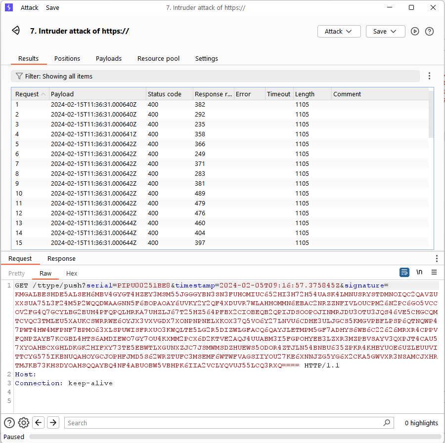

# Burp Suite Timestamp Generator Extension

## Description
This Burp Suite extension automatically generates timestamps, facilitating seamless integration with the Intruder Tools. It enables the effortless insertion of timestamps into payloads, enhancing the efficiency of various security testing activities.

## Features
- Automatically generate timestamps in payloads.
- Seamlessly integrate with Burp Suite's Intruder Tools.
- Configurable timestamp format.

## Requirements
- Burp Suite Professional or Community Edition.
- Python environment with Jython installed.

## Installation
1. Clone or download this repository.
2. Open Burp Suite and navigate to the "Extender" tab.
3. Click on the "Add" button and select the `TimestampGenerator.py` file.
4. The extension will be loaded into Burp Suite.

## Usage
1. After installation, navigate to the Intruder tool within Burp Suite.
2. Configure your attack as usual.
3. Under the "Payloads" tab, select "Payload type" as "Extension-generated".
4. Choose "Timestamp Generator" from the list of available generators.
5. Configure the attack further as needed and start the attack.

## Example

## Support
If you encounter any issues or have any suggestions for improvement, please [open an issue](https://github.com/old-joker/TimestampGenerator/issues) on GitHub.
